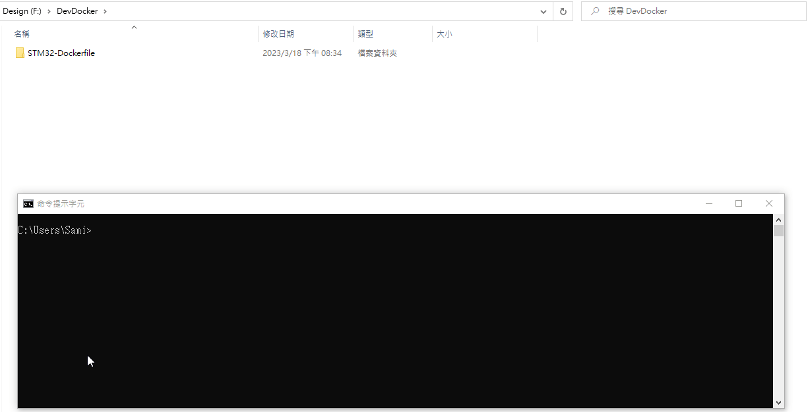

[](https://github.com/jasonyang-ee/STM32-Dockerfile/actions/workflows/test.yml)
[](https://github.com/jasonyang-ee/STM32-Dockerfile/actions/workflows/upload.yml)
[](https://github.com/jasonyang-ee/STM32-Dockerfile/actions/workflows/mdbook.yml)

# Docker Container for STM32 CMake & Ninja Compiling

## Documentation

### Visit [Documentation](http://doc.jasony.org/STM32-Dockerfile) for more information.


## Tags

- `1.0`: No Entrypoint. All build has to be done manually with docker run -it command.
- `2.0`: With Entrypoint. Git repo auto import and build implemented. And, Github Action Supported.
- `3.0`: ARM toolchain downloaded from Linux packages instead. Image size is bigger than v2.0.
- `3.1`: Reverting back to ARM toolchain direct downloaded from website.
- `3.2`: Add Github on premise server support. No TLS certification checking for https clone. 
- `3.3`: Removed args -DCMAKE_EXPORT_COMPILE_COMMANDS=ON -DCMAKE_TOOLCHAIN_FILE:PATH=""
- `4.0`: Add Local Mounted Volume Support. Add Help Menu.
- `4.1`: Modify Action Test. Bug Fixs.
- `4.2`: Modify Action Test. Bug Fixs.
- `4.3`: Modify Action Test. Bug Fixs.
- `4.4`: Bug fix of volume mount path as arguments. Now has correct support on mounted project.
- `5.0`: Supports hybrid git repo URL + local mounted compile. This provides completed compile experience.
- `5.1`: Add Archlinux image and unified tags under stm32-builder. *OLD IMAGES ARE REMOVED*
- `5.2`: Add static analysis tool: clang-format clang-tidy, Lizard, cpplint. Use in dev container only.
- `5.3`: Add multiplatform support.
- `5.8`: Name change to stm32-builder: ubuntu-latest :alpine-latest :arch-latest. Some Bug fix.
- `6.0`: True multiplatform support on Ubuntu and Debian. Alpine and Archlinux for amd64 only.
- `7.0`: Using better argrument parser. *API NOT COMPATIBLE WITH PREVIOUS VERSION*
- `7.1`: Bug fixs. Help menu update.
- `7.2`: Typo fixs.
- `7.3`: Move TLS bypass to top and apply to all situations.
- `7.4`: Using new ARM GCC 13.3.rel1.
- `Latest`: `7.4`


## -+- TL;DR -+-

This docker image auto clone an online git repo and compile the CMake & Ninja supported STM32 project locally on your computer with mounted volume.
```bash
docker run -v "{Local_Full_Path}":"/home" jasonyangee/stm32-builder:ubuntu-latest -r {Git_Repo_URL}
```




## Example Project

For CMake setup, refer to the below STM32 project template.

https://github.com/jasonyang-ee/STM32-CMAKE-TEMPLATE.git


## Help Menu

```
docker run jasonyangee/stm32-builder:ubuntu-latest --help                              
```
>```bash
>Usage: build.sh [OPTIONS]
>Options:
>  -h, --help                            Print this help message
>  -t, --type <build type>               Set CMake build type
>                                        Default: Release
>  -v, --volume <volume mount path>      Path to mount project inside of container and cmake will build in this path
>                                        Default: /home
>  -r, --repo <repository url>           Clone repository from url into volume path and build
>```


## Commands:

```
docker run -v {HostPath}:/home {IMAGE:VERSION} -r {Git_Repo_URL} -t {Build_Type}
```
```
docker run -v {HostPath}:{ContainerPath} {IMAGE:VERSION} -r {Git_Repo_URL} -t {Build_Type} -v {ContainerPath}
```


## Public Registry:

> ghcr.io/jasonyang-ee/stm32-builder:ubuntu-latest

> ghcr.io/jasonyang-ee/stm32-builder:debian-latest

> ghcr.io/jasonyang-ee/stm32-builder:alpine-latest

> ghcr.io/jasonyang-ee/stm32-builder:arch-latest

> jasonyangee/stm32-builder:ubuntu-latest

> jasonyangee/stm32-builder:debian-latest

> jasonyangee/stm32-builder:alpine-latest

> jasonyangee/stm32-builder:arch-latest
