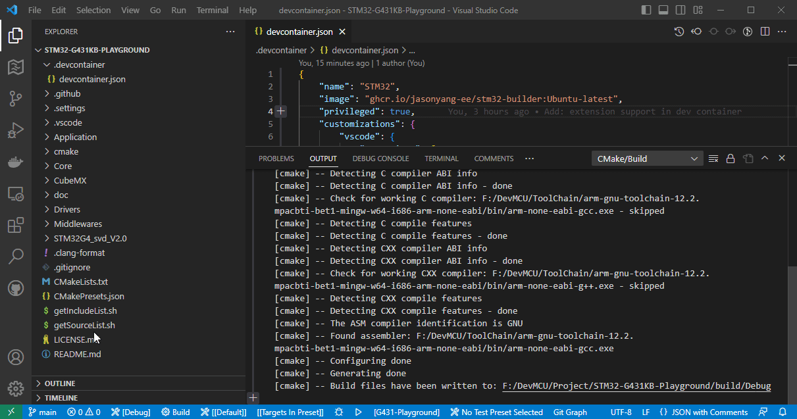

[](https://github.com/jasonyang-ee/STM32-Dockerfile/actions/workflows/build.yml)
[](https://github.com/jasonyang-ee/STM32-Dockerfile/actions/workflows/push.yml)


# Tags

- `1.0`: No Entrypoint. All build has to be done manually with docker run -it command.
- `2.0`: With Entrypoint. Git repo auto import and build implemented. And, Github Action Supported.
- `3.0`: ARM toolchain downloaded from Linux packages instead. Image size is bigger than v2.0.
- `3.1`: Reverting back to ARM toolchain direct downloaded from website.
- `3.2`: Add Github on premise server support. No TLS certification checking for https clone. 
- `3.3`: Removed args -DCMAKE_EXPORT_COMPILE_COMMANDS=ON -DCMAKE_TOOLCHAIN_FILE:PATH=""
- `4.0`: Add Local Mounted Volume Support. Add Help Menu.
- `4.1`: Modify Action Test. Bug Fixs.
- `4.2`: Modify Action Test. Bug Fixs.
- `4.3`: Modify Action Test. Bug Fixs.
- `4.4`: Bug fix of volume mount path as arguments. Now has correct support on mounted project.
- `5.0`: Supports hybrid git repo URL + local mounted compile. This provides completed compile experience.
- `5.1`: Add Archlinux image and unified tags under stm32-builder. *OLD IMAGES ARE REMOVED*
- `5.2`: Add static analysis tool: clang-format clang-tidy, Lizard, cpplint. Use in dev container only.
- `5.3`: Add multiplatform support.
- `5.8`: Name change to stm32-builder: ubuntu-latest :alpine-latest :arch-latest. Some Bug fix.
- `Latest`: `5.8`


Recommandation: Use `5.1` for light weight and `5.5` when running on ARM64 platform.

### Table of Content


- [Tags](#tags)
		- [Table of Content](#table-of-content)
- [Docker Container for STM32 CMake \& Ninja Compiling](#docker-container-for-stm32-cmake--ninja-compiling)
	- [Example Project](#example-project)
	- [Dockerfile](#dockerfile)
	- [Docker Image Compiler Environment](#docker-image-compiler-environment)
- [Basics of This Image](#basics-of-this-image)
	- [Help Menu](#help-menu)
- [Use of This Image](#use-of-this-image)
	- [Use Locally With Git Repo Link](#use-locally-with-git-repo-link)
	- [Use Locally With Mounted Volume](#use-locally-with-mounted-volume)
	- [Use Locally Hybrid](#use-locally-hybrid)
	- [Use Online With Github Action](#use-online-with-github-action)
	- [Use Locally Distributed to Team](#use-locally-distributed-to-team)
		- [Depreciated Methos](#depreciated-methos)
- [Build Image from Dockerfile](#build-image-from-dockerfile)
	- [User Modifications](#user-modifications)
	- [Auto Build Using VS Code Tasks](#auto-build-using-vs-code-tasks)
	- [Manual Build Bash Command Example](#manual-build-bash-command-example)
- [Manual Image Usage](#manual-image-usage)
- [ST-Link](#st-link)
	- [Flash Device in Manual Usage](#flash-device-in-manual-usage)
	- [Prepare USB Passthrough to WSL Docker Container](#prepare-usb-passthrough-to-wsl-docker-container)
	- [Run Docker Container in WSL and Flash STM32](#run-docker-container-in-wsl-and-flash-stm32)
- [Github Action Variables](#github-action-variables)


# Docker Container for STM32 CMake & Ninja Compiling

-+- TL;DR -+-

This docker image auto clone an online git repo and compile the CMake & Ninja supported STM32 project locally on your computer with mounted volume.
```bash
docker run -v "{Local_Full_Path}":"/home" jasonyangee/stm32-builder:ubuntu-latest {Git_Repo_URL}
```

> 


## Example Project

For CMake setup, refer to the below STM32 project template.

https://github.com/jasonyang-ee/STM32-CMAKE-TEMPLATE.git


## Dockerfile

Dockerfile: https://github.com/jasonyang-ee/STM32-Dockerfile.git

Public Registry:
> ghcr.io/jasonyang-ee/stm32-builder:ubuntu-latest

> ghcr.io/jasonyang-ee/stm32-builder:debian-latest

> ghcr.io/jasonyang-ee/stm32-builder:alpine-latest

> ghcr.io/jasonyang-ee/stm32-builder:arch-latest

> jasonyangee/stm32-builder:ubuntu-latest
> 
> jasonyangee/stm32-builder:debian-latest

> jasonyangee/stm32-builder:alpine-latest

> jasonyangee/stm32-builder:arch-latest


## Docker Image Compiler Environment

- [ARM GNU x86_64-arm-none-eabi](https://packages.ubuntu.com/jammy/gcc-arm-none-eabi)
- Ubuntu: [build-essential](https://packages.ubuntu.com/focal/build-essential)
- Alpine: [gcompat](https://pkgs.alpinelinux.org/package/edge/community/x86_64/gcompat) & [libc6-compat](https://pkgs.alpinelinux.org/package/edge/main/x86_64/libc6-compat) & [libstdc++](https://pkgs.alpinelinux.org/package/edge/main/x86_64/libstdc++) & [g++](https://pkgs.alpinelinux.org/package/edge/main/x86_64/g++) & [gcc](https://pkgs.alpinelinux.org/package/edge/main/x86_64/gcc)
- [git](https://git-scm.com/)
- [cmake](https://cmake.org/)
- [ninja-build](https://ninja-build.org/)
- [stlink-tools](https://github.com/stlink-org/stlink)


# Basics of This Image

This image is intended for building STM32 Microcontroller C/C++ Project Configured with CMake and Ninja.

The entrypoint bash script executes basically two commands:
```bash
cmake -DCMAKE_BUILD_TYPE=Release -B /home/build/ -G Ninja
cmake --build /home/build -j 10
```

- `CMAKE_TOOLCHAIN_FILE` must be defined in your project CMakeList.txt file.
- Default build type is `Release`.


## Help Menu
Example usage format can be viewed with `--help` command.
```bash
docker run jasonyangee/stm32-builder:ubuntu-latest --help
```

# Use of This Image


## Use Locally With Git Repo Link

This is intended for testing compile only. It is recommended to `Use Locally Hybrid` for getting binary files.

- Format:
```bash
docker run {IMAGE:VERSION} {Git_Repo_URL}
docker run {IMAGE:VERSION} {Git_Repo_URL} {Build_Type}
```

- Example:
```bash
docker run --name builder jasonyangee/stm32-builder:ubuntu-latest https://github.com/jasonyang-ee/STM32-CMAKE-TEMPLATE.git
docker run --name builder jasonyangee/stm32-builder:ubuntu-latest https://github.com/jasonyang-ee/STM32-CMAKE-TEMPLATE.git Debug
```

- Optionally, you can copy out the binary files:
```bash
docker cp builder:/home/build/{TARGET_NAME}.elf {DEST_PATH}
docker cp builder:/home/build/{TARGET_NAME}.bin {DEST_PATH}
docker cp builder:/home/build/{TARGET_NAME}.hex {DEST_PATH}
```


## Use Locally With Mounted Volume

`Local_Project_Full_Path` is the existing project folder path on your local host machine.

`/proj` is the folder in docker container. It can be any none-Linux-system-folder name in root. Repeating this folder name as 1st argument for entrypoint will invoke the auto compile process. Using `/home` is recommended to avoid confusions between the three different use case.

Binary Output `.bin` `.elf` `.hex` `.map` are located in `Local_Project_Path/build`.

- Format:
```bash
docker run -v "{Local_Project_Full_Path}":"/proj" {IMAGE:VERSION} /proj
docker run -v "{Local_Project_Full_Path}":"/proj" {IMAGE:VERSION} /proj {Build_Type}
```

- Example:
```bash
docker run -v "F:\Project\STM32-CMAKE-TEMPLATE":"/proj" jasonyangee/stm32-builder:ubuntu-latest /proj
docker run -v "F:\Project\STM32-CMAKE-TEMPLATE":"/proj" jasonyangee/stm32-builder:ubuntu-latest /proj Debug
```


## Use Locally Hybrid

Due to hybrid usage and simplicity of required arguments, the container compile folder must be defined as `/home` to work.

`Local_Project_Full_Path` is any empty folder path on local host machine. If no folder existed, one will be created.

- Format:
```bash
docker run -v "{Local_Full_Path}":"/home" {IMAGE:VERSION} {Git_Repo_URL}
docker run -v "{Local_Full_Path}":"/home" {IMAGE:VERSION} {Git_Repo_URL} {Build_Type}
```

- Example:
```bash
docker run -v "F:\test_compile":"/home" jasonyangee/stm32-builder:ubuntu-latest https://github.com/jasonyang-ee/STM32-CMAKE-TEMPLATE.git
docker run -v "F:\test_compile":"/home" jasonyangee/stm32-builder:ubuntu-latest https://github.com/jasonyang-ee/STM32-CMAKE-TEMPLATE.git Debug
```


## Use Online With Github Action

In the application Github repo, create file `.github\workflows\build.yml` with the following script.

This action script will build and upload binary outout to artifact.

In the Github Action use case, docker image entrypoint 1st argument will overwrite build_type.

- Short Example:
```yml
- uses: actions/checkout@v3
- name: BUILD
  run: build.sh
```
```yml
- uses: actions/checkout@v3
- name: BUILD
  run: build.sh Debug
```

- Full Script:

```yml
name: 'Build with Ubuntu Container'
on:
  push:
    branches:
      - 'main'

jobs:
  BUILD_RELEASE:
    runs-on: ubuntu-latest
    container:
      image: 'jasonyangee/stm32-builder:ubuntu-latest'
    steps:
    - uses: actions/checkout@v3
    - name: BUILD
      run: build.sh

    - name: Upload Binary .elf
      uses: actions/upload-artifact@v2
      with:
        name: BINARY.elf
        path: ${{ github.workspace }}/build/*.elf

    - name: Upload Binary .bin
      uses: actions/upload-artifact@v2
      with:
        name: BINARY.bin
        path: ${{ github.workspace }}/build/*.bin
```


## Use Locally Distributed to Team

In case of team usage, it is possible to distribute a fine tuned docker image to standardize an oranization wide compile environment.

1. In VS Code, install extensions:
   - Dev Containers [(ms-vscode-remote.remote-containers)](https://marketplace.visualstudio.com/items?itemName=ms-vscode-remote.remote-containers)
   - Docker [(ms-azuretools.vscode-docker)](https://marketplace.visualstudio.com/items?itemName=ms-azuretools.vscode-docker)

2. Turn on dev container setting: `Execute In WSL`
> 

3. Attach your hardware usb port as describe below in section `7.2`.

3. Creat folder `.devcontainer` and add the example `devcontainer.json` file in this project.
   
4. `Ctrl` + `p` select `Dev Containers: Report in Container`.

5. Build using VS Code Extension or using bash script `build.sh .`.

6. Flash the device as described in section `7`

> 


### Depreciated Methos
>> 2. Start VS Code with your project folder on local computer.
>> 
>> 3. On an individual command windows (Don't run it in VS Code to avoid accidental exit), run docker container as next step.
>> 
>> 4. Docker run using volume mount and override ENTRYPOINT to keep interactive mode live.
>> ```bash
>> docker run -v "F:\Project\STM32-CMAKE-TEMPLATE":"/proj" -it --entrypoint /bin/bash jasonyangee/stm32-builder:ubuntu-latest
>> ```
>> 
>> 5. Attach VS Code onto the container.
>> 
>> 6. Continue any of your dev works. Reminder: this dev container workspace is real-time synced by docker volume mount. Don't >>delete files thinking it  has no effects to local machine.
>> 
>> 7. Build by command using the docker image entrypoint bash script.
>> ```bash
>> build.sh /proj
>> ```
>> 
>> 8. Or, you can install those VS Code extentions: CMake Tools to build like as if it's on local computer.
>> 
>> > 


# Build Image from Dockerfile

If you choose to build your own image from Dockerfile.


## User Modifications

**Check ARM releases at here: <https://developer.arm.com/downloads/-/arm-gnu-toolchain-downloads/>**

- Modify `ARM_VERSION=12.2.rel1` for enforcing compiler version.

- If pulling latest version is desired, insert this line before `curl` command in dockerfile.

```docker
&& ARM_VERSION=$(curl -s https://developer.arm.com/downloads/-/arm-gnu-toolchain-downloads | grep -Po '<h4>Version \K.+(?=</h4>)') \
```


## Auto Build Using VS Code Tasks

- `Ctrl + Shift + p` and enter `run task` and choose the build options: `Build Ubuntu`.
- Modify the build arguments in `.vscode/tasks.json` if you wish to have different image name.
```
stm32-builder:ubuntu-latest",
```


## Manual Build Bash Command Example

```bash
docker build -t stm32-builder:ubuntu-latest -f Dockerfile.ubuntu .
```


# Manual Image Usage

- Docker using volume mount and override ENTRYPOINT to keep interactive mode live
```
docker run -v "F:\Project\STM32-CMAKE-TEMPLATE":"/proj" -it --entrypoint /bin/bash jasonyangee/stm32-builder:ubuntu-latest
```

- Run build script to invoke auto compiling process.
```bash
build.sh /proj
```

- Or optionally, manualy build your project:
```bash
cmake -B build -G Ninja
cmake --build build
```


# ST-Link

ST Link Programmer has not yet been automated. Using `st-link` requires manual image usage adding `--privileged` from previous section to keep interactive mode live, then you will have to find a way to passthrough USB port into container as described in next section.

## Flash Device in Manual Usage

Tool Details: https://github.com/stlink-org/stlink


- Confirm Connnection:
```shell
st-info --probe
```

- Manual Flash:
```shell
st-flash write {TARGET.bin} 0x8000000
```

- Manual Reset:
```shell
st-flash reset
```

## Prepare USB Passthrough to WSL Docker Container

Using Windows machine is difficault to expose USB device to container.

Using WSL maybe the only option for now.

Follow this:
https://learn.microsoft.com/en-us/windows/wsl/connect-usb

- Run cmd (admin mode) on Windows:

```cmd
winget install --interactive --exact dorssel.usbipd-win
wsl --update
wsl --shutdown
```

- Run (restart) WSL Ubuntu:

```shell
sudo apt update
sudo apt install linux-tools-5.4.0-77-generic hwdata
sudo update-alternatives --install /usr/local/bin/usbip usbip /usr/lib/linux-tools/5.4.0-77-generic/usbip 20
```


- Run cmd (admin mode) on Windows:

```cmd
usbipd list
```

> 

- Note the ST-Link ID and bind it on Windows CMD:
```cmd
usbipd bind --busid 3-5
usbipd wsl attach --busid 3-5
usbipd wsl list
```
> 

- Onced a device has been binded, for all future connection, you will only need to attach.

```cmd
usbipd list
usbipd wsl attach --busid 3-5
```


## Run Docker Container in WSL and Flash STM32

Finally, with all of the above understanding, we can combine all and excute the mixed docker run commands:

1. Attach USB device into WSL from Windows CMD (Admin).
2. Start WSL.
3. Check for ST Link Connection.
4. Overwrite entrypoint and volume mount an existing project on WSL.
5. Invoke docker auto build with the mounted volume.
6. Flash STM32

```shell
usbipd list
usbipd wsl attach --busid 3-5
usbipd wsl list
wsl
cd {WSL_USER_PATH}
ls
sudo st-info --probe
docker run -v {WSL_PROJECT_PATH}:{CONTAINER_PROJECT_PATH} -it --privileged --entrypoint /bin/bash jasonyangee/stm32-builder:ubuntu-latest
build.sh {CONTAINER_PROJECT_PATH}
st-flash write {PATH_TO_TARGET.BIN} 0x8000000
```
Note: `--privileged` is necessary to allow device port passthrough

> 


# Github Action Variables

For those who want to setup your own github action to auto publish variation of this dockerfile to your own docker registry. You may copy my action yml file setup and define the following github variables.

```c
vars.REGISTRY			// Github package link (private: ghcr.io  -  org: ghcr.io/Org_Name)
secrete.DOCKERHUB_TOKEN		// Docker Hub login token
secrete.DOCKERHUB_USERNAME	// Docker Hub username
secrete.TOKEN_GITHUB_PERSONAL	// Github package token
secrete.USER_GITHUB_PERSONAL	// Github package username
```