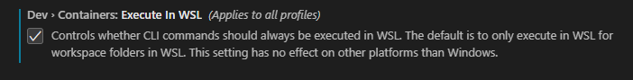
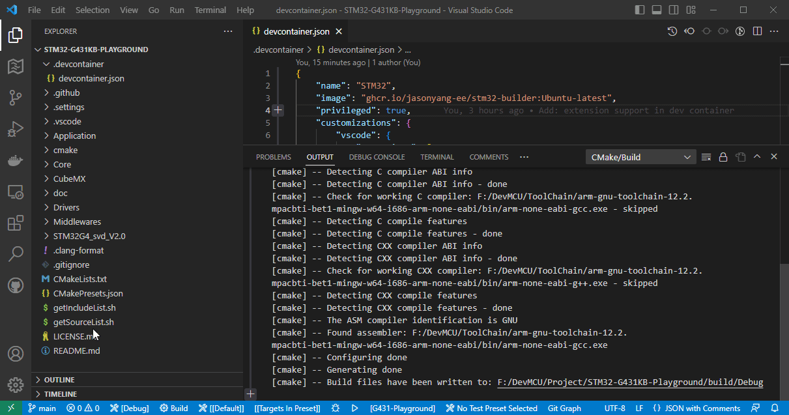

# Use As Dev Container

## Mechanism

In case of team usage, it is possible to distribute a fine tuned docker image to standardize an oranization wide compile environment.

In your project source root, define a `.devcontainer/devcontainer.json` to configure needed VS Code extensions.

Once `reopend in container`, you will be operating in this container OS and be able to consistantly compile binary files while using VS Code to continue the development.

## How To Use

1. In VS Code, install extensions:
   - Dev Containers [(ms-vscode-remote.remote-containers)](https://marketplace.visualstudio.com/items?itemName=ms-vscode-remote.remote-containers)
   - Docker [(ms-azuretools.vscode-docker)](https://marketplace.visualstudio.com/items?itemName=ms-azuretools.vscode-docker)

2. Turn on dev container setting: `Execute In WSL`
> 

1. Attach your hardware usb port as describe below in section [WSL USB Passthrough](WSL_USB.md).

2. Creat folder `.devcontainer` and add the example `devcontainer.json` file in project root.
   
3. `Ctrl` + `Shift` + `p` select `Dev Containers: Reopen in Container`.

4. Build using VS Code Extension or using bash script `build.sh .`.

5. Flash the device as described in section [WSL ST-LINK](WSL_STLINK.md).

> 


## Example

- `devcontainer.json`
	```json
	{
		"name": "STM32",
		"image": "jasonyang-ee/stm32-builder:ubuntu-latest",
		"privileged": true,
		"customizations": {
			"vscode": {
				"extensions": [
					"dan-c-underwood.arm",
					"jeff-hykin.better-cpp-syntax",
					"ms-vscode.cpptools",
					"akiramiyakoda.cppincludeguard",
					"xaver.clang-format",
					"twxs.cmake",
					"ms-vscode.cmake-tools",
					"adpyke.codesnap",
					"mcu-debug.debug-tracker-vscode",
					"marus25.cortex-debug",
					"ms-vscode-remote.remote-containers",
					"ms-azuretools.vscode-docker",
					"cschlosser.doxdocgen",
					"mhutchie.git-graph",
					"donjayamanne.githistory",
					"eamodio.gitlens",
					"zixuanwang.linkerscript",
					"bierner.markdown-preview-github-styles",
					"mcu-debug.memory-view",
					"mcu-debug.rtos-views",
					"albert.tabout",
					"ms-vscode-remote.remote-wsl"
				]
			}
		}
	}
	```