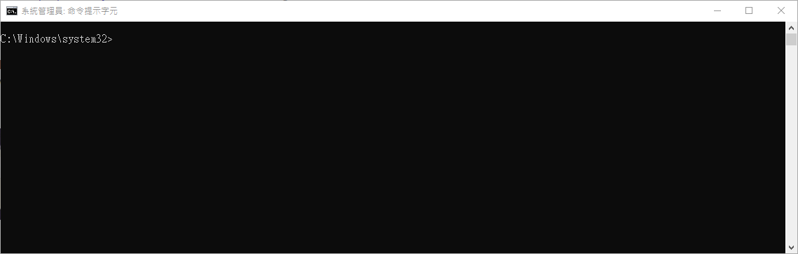

# ST-Link

ST Link Programmer has not yet been automated.

## Mechanism

Once completed [USB Pass Through](WSL_USB.md), you will be able to use `st-link` to flash the device.

- Option 1: [Manual image usage](Menu_Manual.md) with adding `--privileged` interactive mode live.

- Option 2: [Dev Container](Menu_Dev_Container.md) and use VS Code to excute `st-link` commands.


## How To Use

Tool Details: <https://github.com/stlink-org/stlink>


- Confirm Connnection:
	```shell
	st-info --probe
	```

- Manual Flash:
	```shell
	st-flash write {TARGET.bin} 0x8000000
	```

- Manual Reset:
	```shell
	st-flash reset
	```

## Flash Device with Command Line

1. Attach USB device into WSL from Windows CMD (Admin).
2. Start WSL.
3. Check for ST Link Connection.
4. Overwrite entrypoint and volume mount an existing project on WSL.
5. Invoke docker auto build with the mounted volume.
6. Flash STM32

- List of Commands:
	```shell
	usbipd list
	usbipd wsl attach --busid 3-5
	usbipd wsl list
	wsl
	cd {WSL_USER_PATH}
	ls
	sudo st-info --probe
	docker run -v {WSL_PROJECT_PATH}:{CONTAINER_PROJECT_PATH} -it --privileged --entrypoint /bin/bash jasonyangee/stm32-builder:ubuntu-latest
	build.sh {CONTAINER_PROJECT_PATH}
	st-flash write {PATH_TO_TARGET.BIN} 0x8000000
	```

## Flash Device in Dev Container

In project root, create file `.vscode/tasks.json` with the following script.

- `.vscode/tasks.json`
	```json
	{
		"version": "2.0.0",
		"tasks": [
			{
				"type": "shell",
				"label": "Linux: Flash Firmware",
				"command": "st-flash",
				"args": [
					"--reset",
					"write",
					"${command:cmake.launchTargetDirectory}/${command:cmake.buildTargetName}.bin",
					"0x08000000"
				],
				"options": {
					"cwd": "${workspaceFolder}"
				},
				"problemMatcher": []
			},
			{
				"type": "shell",
				"label": "Linux: Reset Device",
				"command": "st-flash",
				"args": [
					"reset"
				],
				"options": {
					"cwd": "${workspaceFolder}"
				},
				"problemMatcher": []
			},
		]
	}
	```

## Example



