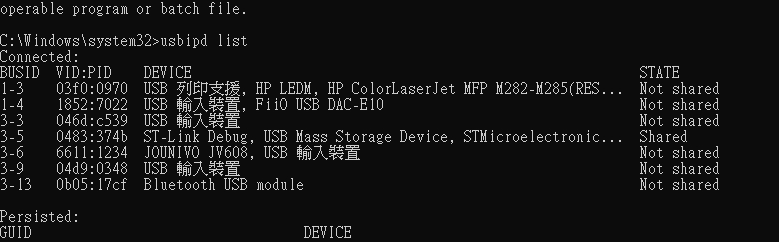
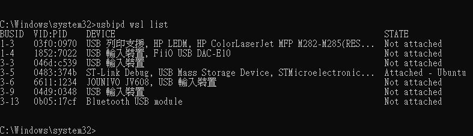

# WSL USB Passthrough to WSL2

Using Windows machine is difficault to expose USB device to container.

Using WSL maybe the only option for now.

Follow this:
https://learn.microsoft.com/en-us/windows/wsl/connect-usb

- Run cmd (admin mode) on Windows:

```cmd
winget install --interactive --exact dorssel.usbipd-win
wsl --update
wsl --shutdown
```

- Run (restart) WSL Ubuntu:

```shell
sudo apt update
sudo apt install linux-tools-5.4.0-77-generic hwdata
sudo update-alternatives --install /usr/local/bin/usbip usbip /usr/lib/linux-tools/5.4.0-77-generic/usbip 20
```


- Run cmd (admin mode) on Windows:

```cmd
usbipd list
```

> 

- Note the ST-Link ID and bind it on Windows CMD:
```cmd
usbipd bind --busid 3-5
usbipd wsl attach --busid 3-5
usbipd wsl list
```
> 

- Onced a device has been binded, for all future connection, you will only need to attach.

```cmd
usbipd list
usbipd wsl attach --busid 3-5
```

